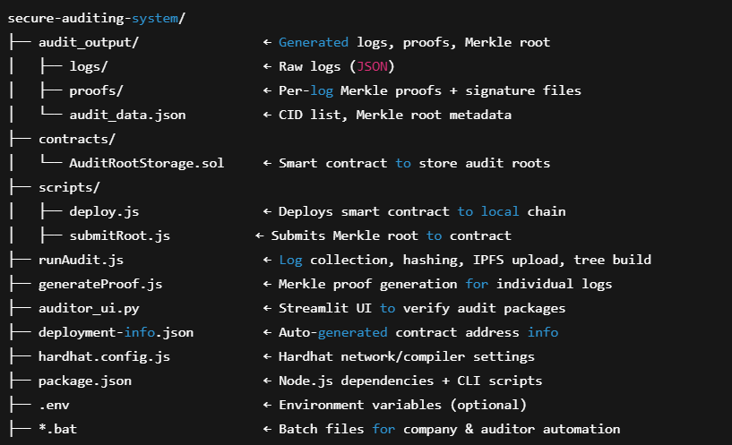

# 🔐 Shadow IT Auditing System (Local Prototype)

> **A tamper-proof, privacy-preserving audit logging system**  
> Uses IPFS, Merkle Trees, and Smart Contracts to ensure verifiable audit logs — built for local simulation with a full auditor verification UI.

---

### ⚙️ System Requirements

- ✅ **Windows OS** (batch files used for automation)  
- ⚠️ **Mac/Linux users** can run `.js` / `.py` scripts manually  
- 🧠 No blockchain or IPFS expertise needed — fully automated!

---

## 🗂️ Project Structure Overview




### 1️⃣ Clone the GitHub Repository

```bash
git clone https://github.com/chauhan-pratham/ShadowIT_Auditing/
cd ShadowIT_Auditing
````

---

## 🛠️ System Setup Guide

This section walks you through installing required tools and running the entire auditing system with a few simple batch files.

---

### 📦 Step 1: Install Node.js

1. Download Node.js LTS version:
   👉 [https://nodejs.org/](https://nodejs.org/)

2. Install with default options.

3. Confirm installation:

```bash
node -v
npm -v
```

---

### ⚙️ Step 2: Set Up the Project

Open a terminal in the project folder and run:

```bash
# Install core dependencies
npm install ps-list ethers dotenv keccak256 merkletreejs

# Install Hardhat & dev tools
npm install --save-dev hardhat @nomicfoundation/hardhat-toolbox
```

> ✅ You do **not** need to manually run Hardhat commands — the batch files handle it.

---

### 🔧 Step 3: Start Local Blockchain Node

1. Double-click:

```
1_start_node.bat
```

This launches a local Ethereum node (`npx hardhat node`).
⚠️ **Leave this terminal open** while using the system.

---

### 💾 Step 4: Start IPFS Desktop

1. Download & install IPFS Desktop:
   👉 [https://docs.ipfs.tech/install/ipfs-desktop/](https://docs.ipfs.tech/install/ipfs-desktop/)

2. Launch the app and confirm it's running at:

```
http://127.0.0.1:5001
```

> This acts as your local decentralized file storage.

---

### 🏢 Step 5: Run the Company Workflow

To perform all company-side tasks (deploy, collect logs, sign, hash, upload to IPFS, anchor on blockchain):

1. Double-click:

```
2_run_company_workflow.bat
```

2. Choose an option from the menu:

   * `1` → Run weekly audit (collect logs, upload to IPFS, submit Merkle Root)
   * `2` → Generate auditor proof package for a specific log
   * `3` → (Advanced) Re-deploy contract from scratch
   * `4` → Exit

> ℹ️ On first run, the contract is deployed automatically.

---

### 🧪 Step 6: Install Python Requirements & Verify Logs (Auditor Role)

> This step is **required** to enable the `Streamlit`-based auditor dashboard for verifying log authenticity and integrity.

---

#### 🧰 A. Install Python & Required Packages

1. Make sure Python 3.8 or higher is installed:
   👉 [https://www.python.org/downloads/](https://www.python.org/downloads/)

2. Open a terminal and install required packages:

```bash
pip install streamlit psutil cryptography pycryptodome
```

These packages enable:

* 🧠 TPM-like digital signature verification
* 🔐 Secure hashing & Merkle proof validation
* 🌐 Launching the Streamlit auditor dashboard

---

#### 🕵️ B. Auditor Workflow: Verifying a Log

1. Receive these 4 files from the company:

   * `process_log_X.json`
   * `process_log_X.sig`
   * `process_log_X.sha256`
   * `process_log_X.proof.json`

2. Launch the verification UI by double-clicking:

```
3_start_auditor_ui.bat
```

3. Upload the 4 files into the browser window when prompted.

4. The system will automatically perform 3 checks:

   * ✅ **Integrity**: Ensures log hash matches `.sha256`
   * ✅ **Origin**: Validates `.sig` using stored public key
   * ✅ **Inclusion**: Recomputes Merkle Root and matches `.proof.json`

5. If all checks pass, the log is **verifiably authentic and untampered**.

---

✅ Your secure auditing system is now fully operational — cryptographically traceable, blockchain-anchored, and audit-ready.

---


